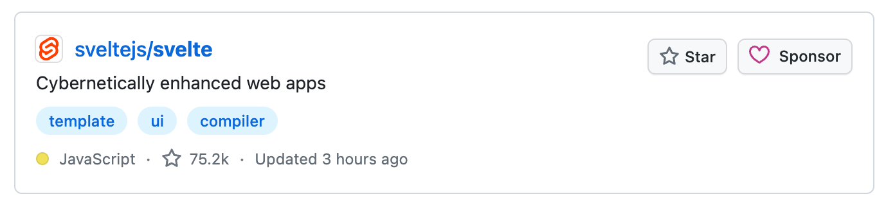

## 是什么

对于国内前端开发者来说，前端框架首选无疑是React和Vue、退而其次是Angular。从本章开始，笔者将和大家一起了解一个不同于React和Vue等以虚拟dom为核心的框架，它在国外的关注程度一度超过了前端框架的龙头React，这个框架就是——[Svelte](https://github.com/sveltejs/svelte)。

Svelte在英文中具有“苗条的，身材修长的”意思，对于刚接触的开发者来说，非常容易与Java的Servlet搞混。Servlet是运行在Web服务器中的小型Java程序，其是JavaWeb的三大组件之一，而Svelte则是一个前端UI框架，更准确地说，Svelte是一个编译器。

### 作者

正如我们提到React会想到[Dan Abramov](https://github.com/gaearon)，提到Vue会想到[Evan You](https://github.com/yyx990803)，那Svelte的创建者[Rich Harris](https://github.com/Rich-Harris)，在前端业界也享誉盛名。也许有些开发者不了解Rich Harris是何人，那和webpack齐名的打包工具Rollup便是出自此人之手。除了Rollup之外，Rich Harris还开发了Reactive、Svelte等诸多流行的开源作品，积极地投身于开源当中。
Svelte是Rich Harris在[《卫报》](https://www.theguardian.com/international)工作时的成果。Rich Harris曾担任《卫报》美国版的互动编辑。在加入卫报英国互动团队担任前端开发人员之前，他曾在 Citywire 担任财经记者、视频记者和网络制作人。


### 历史

Svelte的前身是发布于2013年的[Ractive.js](https://github.com/ractivejs/ractive)，后者几乎与React同时问世。Reactive.js的灵感来自于 Knockout 和 Angular 以及当时其他一些东西的混搭。经过几年的实践，Rich Harris觉得Reactive.js并不是真正适合移动互联网时代的框架，于是在BrooklynJS聚会上和友人提出了自己的框架新想法——写一个编译器。

Svelte的第一个版本基本上就是多了一个编译器的Reactive。因为当时《卫报》的同事在使用Reactive，且拥有一个现成的Reactive社区，为了能够更好地推广Svelte，Svelte第一版继承了Reactive的许多相同设计。Svelte 这个名字是由Rich Harris和他在《卫报》的同事们选择的。随着时间的推移，越来越多的开发者开始了解Svelte并对其产生兴趣。

之后，Svelte开发团队意识到 Ractive 的一些设计决策是错误的，因此 Svelte 2 实际上只有一些小小的改进。例如，在模板语法中不再使用双花括号，而是使用单花括号，因此这更像是 JSX，并且还进行了一些其他类似的修饰性更改。但除此之外，它与 Svelte 1 几乎相同。

第三版是一次重大修改，Svelte开发团队开始[重新思考](https://svelte.dev/blog/svelte-3-rethinking-reactivity)现代 UI 框架的核心概念：反应性。到2019年，Svelte已经成为一个成熟的工具，可以构建具有[TypeScript](https://www.wbolt.com/go?_=bc24523fcaaHR0cHM6Ly93d3cudHlwZXNjcmlwdGxhbmcub3JnLw%3D%3D)支持的开箱即用的Web应用程序。

经过4年的时间，Svelte4在2023年成功发布。Svelte4作为一个过渡版本，可以比作是React16 到18之间React 17版本，为下一代 Svelte（即 Svelte 5）的发布奠定了基础。

  

打包体积，Even You拿vue和svelte对比

  https://github.com/yyx990803/vue-svelte-size-analysis
  
https://github.com/yyx990803/vue-svelte-size-analysis?spm=a2c6h.12873639.article-detail.8.71122eacS8dYWL

https://github.com/halfnelson/svelte-it-will-scale
  

https://svelte.dev/blog/virtual-dom-is-pure-overhead

  

## 怎么样

### 优势

#### 性能

通过[benchmark](https://github.com/krausest/js-framework-benchmark)上的性能对比，我们可以看到Svelte除了稍逊于Solid外，整体的表现优于React、Vue和Angular等前端框架。
![[Pasted image 20240309222135.png]]
高性能

**没有虚拟DOM**。Svelte是一个编译器，不使用虚拟DOM，Svelte是一个编译器，在构建时就知道你的应用程序中的东西可能会发生变化，而不是等待在运行时做这些工作。这是Svelte相对于其他任何Web框架的一个非常重要的优势


产物体积小

TODO: 文件大小

|框架名称|react|vue|angular|svelte|
|---|---|---|---|---|
|体积|42k|22k|89.5k|1.6k|

TODO: 重写
    从上述对比中可以看出，svelte的体积很少，虽然其业务代码在编译后会生产较多的代码。**得益于较少的运行时代码。虽然svelte代码的随着业务的编写增量速度比较快，得益于其很小的包体积1.6k，对于一般中小型项目而言，整体运行的代码（编译后的代码+包体积）还是比较小的**，所以可以说svelte项目的代码较小。不过对于大型项目而言，因为svelte随着业务的进行，运行时代码增量陡峭，大型项目体积并不会比react、vue等小,因此需要辩证看待

#### 心智负担

Svelte语法简单，上手容易，学习曲线小。任何学过html，css和javascript的开发者都能上手。Svelte允许使用者使用足够少的代码来完成功能运行，比如一段最简单的代码：
```html
<script>
	let count = 0;
</script>

<button on:click={() => count++}>add</button>
```

Svelte帮助开发者以最小的代价构建用户界面，通过实现更好的反应性、绑定和顶层元素等，提高了代码的可读性，降低了开发者的心智负担和上手难度。

#### 关注度
Svelte的以上特性让其在国外前端圈大放异彩。

首先是在Github上，达到了75k以上的Star。


在[risingstars](https://risingstars.js.org/2023/en#section-framework)的2023年报告上。可以看到Svelte在Github上星数上涨在前端框架中排名第三。

  
在[stateofjs](https://2022.stateofjs.com/zh-Hans/libraries/front-end-frameworks/)的2022年度报告中（笔者在写文章时2023年报告结果暂时未出），Svelte的关注度和满意度都名列前茅。


### 劣势

#### 生态
Svelte的发布

  
#### 代码冗余
编译后的代码逻辑冗余。也许有读者会担心，如果业务逻辑复杂，导致编译之后的代码文件大小直线上升，是否会在一定程度上导致性能下降？Github上有相关开发人员对于这个问题进行了分析[svelte-it-will-scale](https://github.com/halfnelson/svelte-it-will-scale)


![[Pasted image 20240309221120.png]]
Rich Harris 的[virtual-dom-is-pure-overhead](https://svelte.dev/blog/virtual-dom-is-pure-overhead)一文中，指出 virtual dom 并非免费的午餐，它也会带来性能和内存上的消耗。例如一个 HelloWorld 的组件，要把 `props`的值进行修改，需要三个步骤：

  

1. 先后两次 virtual dom 要记录下来，对相同的节点进行比较

2. 需要把该节点上所有的属性进行对比，记录下变动的内容

3. 更新真实 dom

  

svelte 则是省去前面两步，直接更新 dom，它是一个 compiler，对已有的组件进行预编译，最终实现的代码。

  

尤雨溪发推说 vue3 能够比 svelte 更加快

npm trends

  

https://npmtrends.com/svelte

  
#### 国内推广

虽然Svelte在国外已经风靡数时，但其下载量目前仍然无法。。。。。。
在国内的推广程度不够高
https://npmtrends.com/react-vs-svelte-vs-vue


## 为什么

为什么我要学习Svelte？这里笔者简单的给出几点理由：

* 技术创新。当今的前端框架中，虚拟DOM的实现方式大行其道。不同于虚拟DOM的实现方式，Svelte以静态编译的方式实现了前端框架的响应性，这不仅开拓了我们的技术视野，也提升我们在开发中除了要拥抱潮流外，同样需要思考与创新。
* 性能。在小型业务中的性能表现优秀
* 学习曲线。上手简单
* 国际化。Svelte在国外能够有如此高的呼声，自然有自身的吸睛点。我们不能固步自封，把自己的技术栈局限于React和Vue，学习Svelte能够让我们加入到前端新浪潮中，与国际前端圈接轨，减少彼此之间的信息差。同时，因为Svelte起步晚，有些生态库不够全面，如果读者你恰好是开源开好者，稍显贫瘠的生态土壤正是你大显身手的好时机。

## 小结

我们从什么是Svelte，Svelte的优劣势，以及我们为什么需要学习Svelte这三个方面，初步认识了Svelte这股前端框架新势力。在下一篇章，我们将了解如何安装svelte相关的开发环境和简单的上手使用它。
