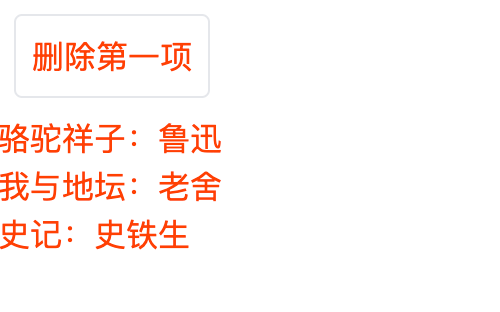

## 条件判断

  
```

{#if}

{:else if}

{:else}

{/if}

```

`{:else if}`和`{:else}`是可选的。
  

## 循环判断

  

```

{#each list as item, index (key))}

{:else}

{/each}

```

`{:else}`可选。

item解构

key作用，key的位置 item (key), i    或 item, i (key) ?

```html
<script>
  export let bookName;

  const authors = {
    狂人日记: "鲁迅",
    骆驼祥子: "老舍",
    我与地坛: "史铁生",
    史记: "司马迁",
  };

  const author = authors[bookName];
</script>

<div>{bookName}：{author}</div>
```


```html
<script>
  import Book from "./Chapter00_Child.svelte";

  let books = [
    {
      id: 1,

      name: "狂人日记",
    },
    {
      id: 2,

      name: "骆驼祥子",
    },
    {
      id: 3,

      name: "我与地坛",
    },
    {
      id: 4,

      name: "史记",
    },
  ];

  const deleteBook = () => {
    books = books.slice(1);
  };
</script>

<button class="border m-2 p-2 rounded" on:click={deleteBook}>删除第一项</button>

{#each books as item}
  <Book bookName={item.name} />
{/each}
```

当我们点击删除时，你便会看到：


可能刚开始读者朋友们记这些标签会偶尔搞混，这里笔者给大家总结了规律。开始以`#`，中间部分`:`，结尾`/`

## 小结