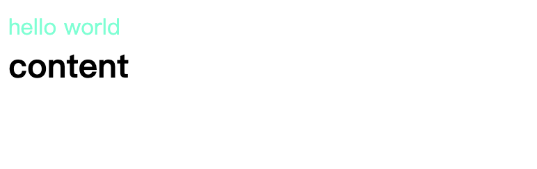

## style标签

### scoped

在`<style></style>`内编写的样式默认是scoped，组件内生效的。
```html
<!-- Child.svelte -->
<p class="txt">hello svelte</p>

<style>
  .txt {
    color: green;
  }
</style>
```

```html
<script>
// App.svelte
  import Child from './Child.svelte';
</script>

<p class="txt">hello 1</p>
<Child />

<p class="txt">
  hello 2
  <Child />
</p>

<style>
.txt {
  color: red;
}
</style>
```


在上述例子中，笔者编写了一个绿色字体的组件，可以看到，即使外部的字体都设置成了红色，也没有影响到组件内部的样式。

从编译后的html内容中可以看到，每个节点的样式class都添加了单独的s-xxx选择器。

### global

在一些情况下，我们需要让我们的样式不止在组件内生效，最常见的场景便是修改UI组件的样式。一个UI组件库通常有自己的固定样式，当我们引用了UI组件库后，往往需要重新修改原有样式以适配业务。

```html
<!-- Button.svelte -->
<button class="svelte-button">button</button>

<style>
  .svelte-button {
    border: 1px solid black;
    border-radius: 4px;
    padding: 4px 8px;
  }
</style>
```

```html
<script>
  // App.svelte
  import Button from './Button.svelte';
</script>

<Button />

<div class="button-wrapper">
<Button />
</div>

<style>
:global(.button-wrapper .svelte-button) {
  border: none;
  background-color: orange;
  border-radius: 8px;
  color: white;
}
</style>
```


我们设置了一个Button.svelte来作为UI组件的例子，当App.svelte正常引入这个组件时，展示的是其原有的样式，通过`:global()`我们能够正常覆盖组件内的样式。
## 预处理器

CSS可以用来修改网页样式和外观，但严格意义上讲，CSS并不是一种编程语言，无法使用它来进行编程。CSS不像其他编程语言一样能够进行复杂程序逻辑的操作，而且写起来很费事，代码难以组织和维护。CSS 预处理器应运而生。

CSS 预处理器所做的本质上是为 CSS 增加一些可编程的特性，通过**变量**、**嵌套**、**简单的程序逻辑**、**计算**、**函数**等特性，通过工程化的手段让 CSS 更易维护，提升开发效率。

目前主流的 CSS 预处理器主要有 Sass、Less、Stylus、PostCSS。

### Less
```bash
npm install svelte-preprocess-less less -D
```

```javascript
// vite.config.js
import { defineConfig } from 'vite'
import { svelte } from '@sveltejs/vite-plugin-svelte'
import { less } from 'svelte-preprocess-less';

// https://vitejs.dev/config/
export default defineConfig({
  plugins: [svelte({
    preprocess: {
      style: less()
    }
  })],
})
```

```less
// component.less
.wrap {
  header {
    color: aquamarine;
  }
  .content {
    font-size: 24px;
    font-weight: bold;
  }
}
```

```html
<!-- Component.svelte -->
<div class="wrap">
  <header>hello world</header>
  <div class="content">content</div>
</div>

<style lang="less">
@import "./component.less";
</style>
```


### Sass

```bash
npm install svelte-preprocess-sass sass -D
```

```javascript
// vite.config.js
import { defineConfig } from 'vite'
import { svelte } from '@sveltejs/vite-plugin-svelte'
import { sass } from 'svelte-preprocess-sass';

// https://vitejs.dev/config/
export default defineConfig({
  plugins: [svelte({
    preprocess: {
      style: sass()
    }
  })],
})
```

```html
<div class="wrap">
  <header>hello world</header>
  <div class="content">content</div>
</div>

<style lang="sass">
@import ./component.sass
</style>
```

```scss
// component.sass
.wrap 
  header 
    color: aquamarine
  .content 
    font-size: 24px
    font-weight: bold
```

### Stylus

```bash
npm install svelte-preprocess stylus -D
```

Stylus除了需要在vite.config.js中配置外，还需要在svelte.config.js中配置。
```javascript
// vite.config.js
import { defineConfig } from 'vite'
import { svelte } from '@sveltejs/vite-plugin-svelte'

// https://vitejs.dev/config/
export default defineConfig({
  plugins: [svelte()],
})
```

```javascript
// svelte.config.js
import { vitePreprocess } from '@sveltejs/vite-plugin-svelte'
import * as sveltePreprocess from 'svelte-preprocess';

const { stylus } = sveltePreprocess.default;

export default {
  // Consult https://svelte.dev/docs#compile-time-svelte-preprocess
  // for more information about preprocessors
  preprocess: vitePreprocess({
    preprocess: [
      stylus()
    ]
  }),
}
```

```stylus
// component.styl
.wrap 
  header 
    color aquamarine
  .content 
    font-size 24px
    font-weight bold
```

```html
<div class="wrap">
  <header>hello world</header>
  <div class="content">content</div>
</div>

<style lang="stylus">
@import "./component.styl"
</style>
```
## 行内样式

### 表达式

我们可以在行内样式中，在`{}`内使用变量或表达式。
```html
<script>
  let color = 'gray'
</script>

color: <input bind:value={color} />

<div style="color: {color};">color</div>
```


```html
<script>
  let color = "gray";
</script>

color: <input bind:value={color} />

<div style="color: {color}; {color === 'red' ? 'font-size: 32px;' : ''}">
  color
</div>
```


在这个例子中，我们可以在`{}`内进行表达式的判断，从而实现动态加载一些样式。

### 指令

可以通过`style:property={value}`的形式来操作行内样式。
```html
<script>
  let color = "gray";
</script>

color: <input bind:value={color} />

<div
  style:color
  style:font-size={color === "red" ? '32px' : ''}>
  color
</div>
```
例子中的代码同样可以实现上图的效果。

遗憾的是，不同于React，我们无法往style属性中传入一个对象类型的值，Svelte目前不支持对象类型的样式值。我们可以使用一些转换的库如[style-object-to-css-string](https://www.npmjs.com/package/style-object-to-css-string)，也可以自己定义转换功能。

```javascript
export const styleToString = (style: Record<string, string | number>): string => {
  return Object.keys(style).reduce((str, key) => {
    const value = style[key];
    return str + `${key}: ${value};`;
  }, '');
}
```

```html
<script>
  let color = "red";
  $: style = {
    color: color,
    "font-size": "32px",
  };

  const styleToString = (style) => {
    return Object.keys(style).reduce((str, key) => {
      const value = style[key];
      return str + `${key}: ${value};`;
    }, "");
  };

  $: styleStr = styleToString(style);
</script>

color: <input bind:value={color} />

<div style={styleStr}>color</div>
```


## class属性

### 简写

```html
<!-- 它们是等价的 -->
<div class="{active ? 'active' : ''}">...</div>
<div class:active={active}>...</div>

<!-- 简写 -->
<div class:active>...</div>

<!-- 可以包含多个class状态 -->
<div class:active class:inactive={!active}>...</div>
```

### 原子化
在Svelte中，同样可以使用一些流行的原子化CSS框架，诸如[Tailwind CSS](https://tailwindcss.com/)、[UniCSS](https://unocss.dev/)等。Svelte的诸多UI库，均选择了Tailwind等原子化框架来处理样式，比如：[shadcn-svelte](https://www.shadcn-svelte.com/)、[melt-ui](https://melt-ui.com/)。

## 变量
#### css变量

style中的样式跟随变量更改
```html
<script>
  let color = "red";
</script>

文案颜色：<input bind:value={color} />
<span class="text" style="--color: {color}">hello world</span>


<style>
  .text {
    color: var(--color);
    border: 1px solid var(--color);
    padding: 3px;
  }
</style>
```


CSS 变量会破坏 Svelte 组件局部作用域的特性。
### CSS-in-Js

同样，我们可以使用一些cssinjs库和Svelte结合使用。以[Emotion](https://emotion.sh/docs/introduction)为例：
```html
<script>
  import { css } from '@emotion/css';

  let color = 'black';

  $: style = css`
    width: 100px;
    padding: 8px;
    border: 1px solid #eee;
    font-size: 24px;
    border-radius: 4px;
    color: ${color};
    &:hover {
      box-shadow: 5px 10px 20px ${color};
    }
  `;
  
</script>

<select bind:value={color}>
  <option value="black">black</option>
  <option value="red">red</option>
  <option value="green">green</option>
</select>
color: {color}
<div class={style}>
  Css in js
</div>
```


## 小结


