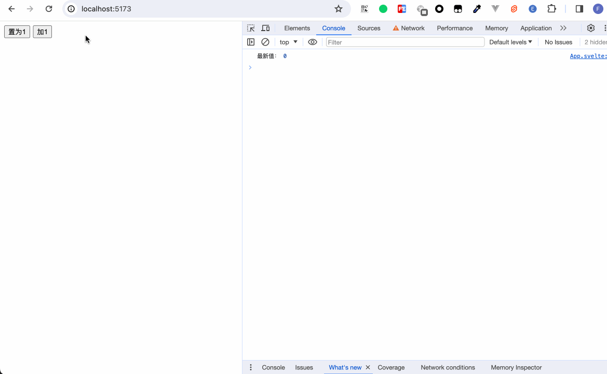
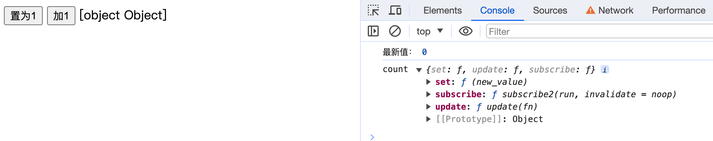
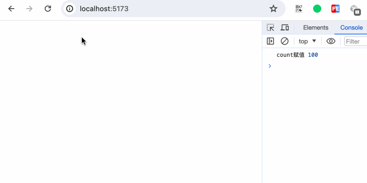
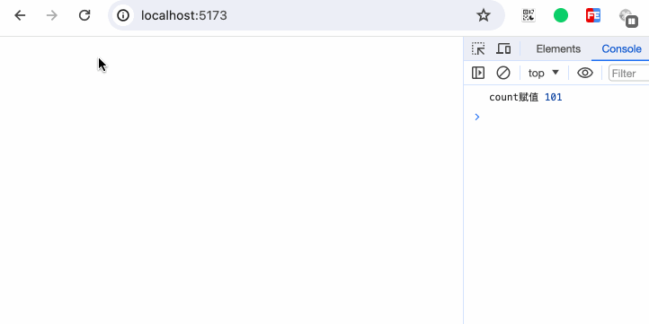
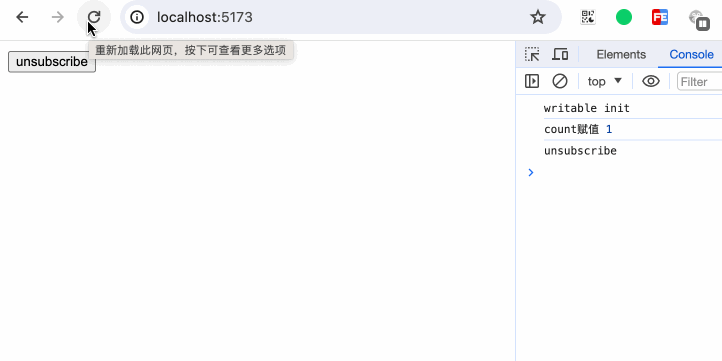
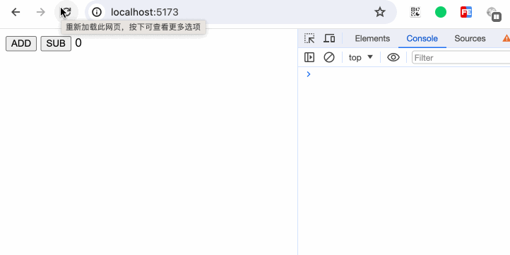

当业务逻辑简单时，我们可以把所有变量都放在各自的组件或页面内。然而真实的开发情况是，我们的业务逻辑会越来越复杂，页面所承载的数据，亦或者页面与页面之间公用的状态等会变得越来越庞大。此时如何处理和维护系统的状态将变得尤为关键。

## svelte/store

React 的 Redux，或者 Vue 的 Vuex， Pinia。而Svelte内部直接提供了`svelte/store`来管理状态。

svelte/store导出了三个方法`writable`、`readable`和`derived`。

在Svelte中， store（也即状态）只不过是具有 `subscribe` 方法的普通对象，

可以认为只要一个对象正确地实现了 `subscribe` 方法，它即是一个 store

### 可写状态 writable

writable的使用如下：
```javascript
function writable<T>(
	value?: T | undefined,
	start?: StartStopNotifier<T> | undefined
): Writable<T>;
```
writable的第一个参数表示数据的初始值。第二个参数是一个方法，这个方法内部可以返回一个方法。

```javascript
export type StartStopNotifier<T> = (
	set: (value: T) => void,
	update: (fn: Updater<T>) => void
) => void | (() => void);
```

当一个store是一个 _writable_ store（可写状态），这表示除了 `subscribe` 方法外，它还具有 `set` 和 `update` 方法。

```javascript
// store.js
import { writable } from 'svelte/store';
export const count = writable(0);
```

```html
<script>
// App.svelte
  import { count } from './store';

  count.subscribe(c => {
    console.log('最新值：', c);
  })

  const onSet = () => {
    count.set(1);
  }

  const onUpdate = () => {
    count.update(c => c + 1);
  }
</script>


<button on:click={onSet}>置为1</button>
<button on:click={onUpdate}>加1</button>
```



如果我们直接写`{count}`，页面上如下展示：

很明显，count已经不是简单的变量。尝试把count`$: console.log('count', count)`打印出来。

此时的count是一个对象，内部有set、subscribe、update方法。

#### 订阅更新
我们在页面中要如何使用writable state？一个取巧的方式是，我们在页面内部声明一个变量，然后在subscribe监听到状态变化时，将最新的更改赋值给我们声明的变量。
```html
<script>
let _count;

const unsubscribe = count.subscribe(c => {
  _count = c;
});
</script>

{_count}
```


#### 取消订阅
仍旧以上面例子为例，我们把原本在App.svelte的逻辑移入到Child.svelte，然后引入Child.svelte
```html
<script>
  import Child from './Child.svelte';
  import { count } from './store';
  
  let countValue = 0;

  count.subscribe(value => {
    countValue = value;
  })

  const onUpdate = () => {
    count.update(c => c + 1);
  }
</script>

{#if countValue < 5}
  <Child />
{/if}

<button on:click={onUpdate}>father update</button>
```


可以看到App.svelte和Child.svelte内都能更新count。而当Child.svelte因为不满足if条件而被销毁之后，内部的subscribe仍在执行，这显然是不符合期望的。试想一下，如果我们有成千上万个有显示隐藏功能的组件都进行了subsribe。每当这些组件销毁时，这些监听事件仍被保留，久而久之，将会出现内存溢出的风险。因此，每当我们执行了subscribe后，记得在合适的时机进行销毁。
subscribe执行后返回一个方法，这个方法变用来取消订阅。

修改Child.svelte的代码
```html
<script>
  import { onDestroy } from 'svelte';
  import { count } from './store';

  const unsubscribe = count.subscribe(c => {
    console.log('最新值：', c);
  })

  const onSet = () => {
    count.set(1);
  }

  const onUpdate = () => {
    count.update(c => c + 1);
  }

  onDestroy(unsubscribe);
</script>


<button on:click={onSet}>置为1</button>
<button on:click={onUpdate}>加1</button>
```
  

#### 第二个参数
开头我们已经介绍了writable的两个传参的含义，现在我们来演示一下第二个参数的使用。第二个参数接受的是一个方法。这个方法接收两个参数`set`和`update`。

 set

```html
<script>
  import { count } from './store';

  count.subscribe(val => {
    console.log('count赋值', val);
  })
</script>
```

```javascript
import { writable } from 'svelte/store';

export const count = writable(1 ,(set, update) => {
  set(100);
});```



update

```javascript
import { writable } from 'svelte/store';

export const count = writable(1 ,(set, update) => {
  update(value => value + 100);
});
```



return () => void
```html
<script>
  import { count } from './store';

  const unsubscribe = count.subscribe(val => {
    console.log('count赋值', val);
  });
</script>

<button on:click={unsubscribe}>unsubscribe</button>
```

```javascript
import { writable } from 'svelte/store';

export const count = writable(1 ,(set, update) => {
  console.log('writable init');
  return () => {
    console.log('unsubscribe');
  }
});
```


### 可读状态 readable


### 状态继承 derived
如果读者接触过React或Vue，那可以把derived看做是React的useMemo、Vue的computed。

## 自动订阅

在介绍可写状态时，我们了解了如何使用可写状态来更新和取消订阅。然而每次需要手动地执行赋值更新操作和时刻关注取消订阅的行为实在过于繁琐。为此，Svelte提供了一种快捷的方式来处理这一问题：每当引用 store时，都可以通过在其前面加上 `$`字符来访问其在component内部的值，这会使Svelte自动声明前缀变量，并设置将在适当时取消订阅。

## 自定义store

只要一个对象正确地实现了 subscribe 方法，它即是一个 store。除了之外，怎样都行。
当我们需要知道 `count` 当前值的时候，应该使用 `update`，它会将当前值传递到回调函数供你使用；如果无需知道，则使用 `set`

## 第三方库

### rxjs

### immer
### xstate
```bash
npm i xstate @xstate/svelte
```

"@xstate/svelte": "^3.0.2"

```html
<script>
  import { useMachine, useSelector } from '@xstate/svelte';
  import { countMachine } from './store';
  
  const { send, actorRef } = useMachine(countMachine);

  const state = useSelector(actorRef, (selector) => {
    return selector.context;
  });
</script>


<button on:click={() => send({ type: 'ADD' })}>
  ADD
</button>
<button on:click={() => send({ type: 'SUB' })}>
  SUB
</button>

{$state.count}
```

```javascript
import { createMachine, assign } from "xstate";

export const countMachine = createMachine({
  id: "counter",
  context: {
    count: 0
  },
  initial: 'active',
  states: {
    active: {
      on: {
        ADD: {
          actions: assign({
            count: ({ context }) => context.count + 1
          })
        },
        SUB: {
          actions: assign({
            count: ({ context }) => context.count - 1
          })
        }
      }
    }
  },
});
```


## 小结
