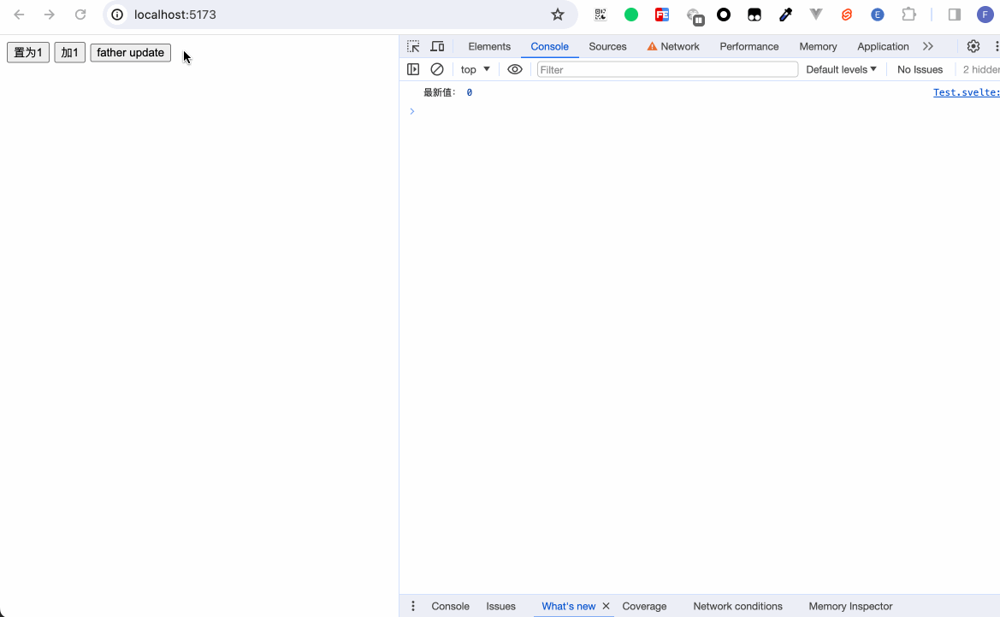
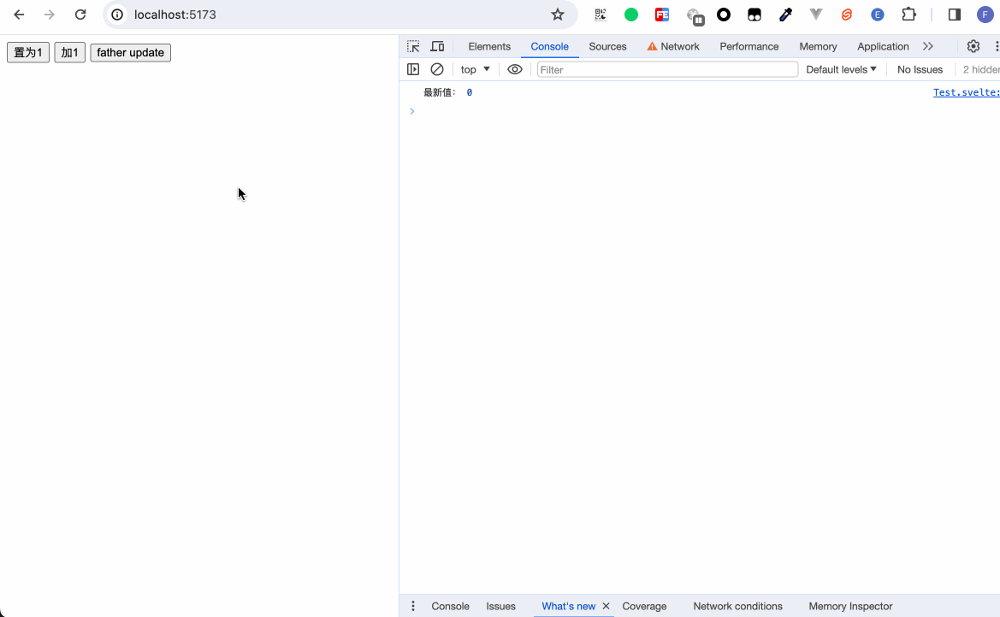
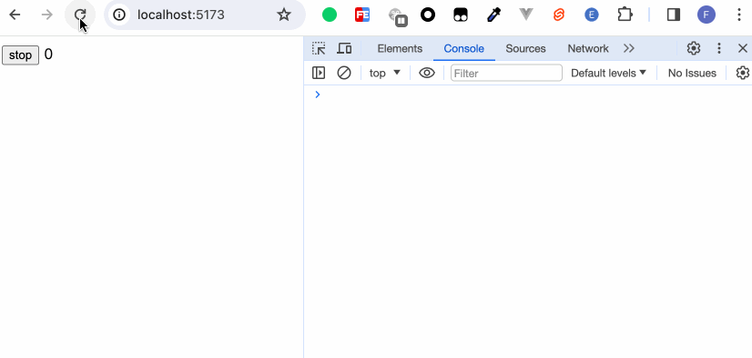
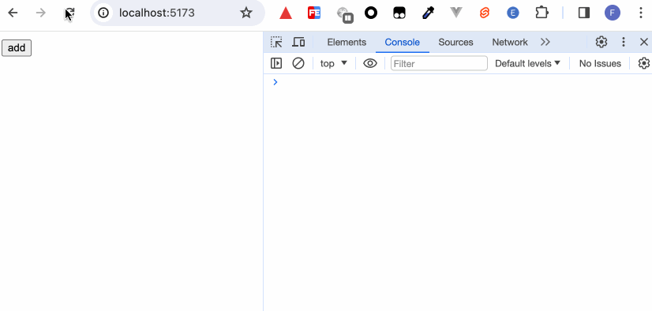
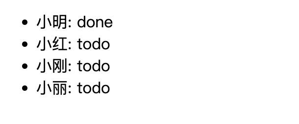
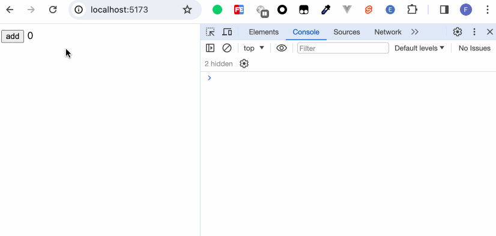

https://monad.fi/en/blog/svelte-custom-stores/
当业务逻辑简单时，我们可以把所有变量都放在各自的组件或页面内。然而真实的开发情况是，我们的业务逻辑会越来越复杂，页面所承载的数据，亦或者页面与页面之间公用的状态等会变得越来越庞大。此时如何处理和维护系统的状态将变得尤为关键。

## svelte/store

React 的 Redux，或者 Vue 的 Vuex，Pinia。而Svelte内部直接提供了`svelte/store`来管理状态。

svelte/store导出了三个方法`writable`、`readable`和`derived`。

### 可写状态 writable

writable的使用如下：
```javascript
function writable<T>(
	value?: T | undefined,
	start?: StartStopNotifier<T> | undefined
): Writable<T>;
```
writable的第一个参数表示数据的初始值。第二个参数是一个方法，这个方法内部可以返回一个方法。

```javascript
export type StartStopNotifier<T> = (
	set: (value: T) => void,
	update: (fn: Updater<T>) => void
) => void | (() => void);
```

当一个store是一个 _writable_ store（可写状态），这表示除了 `subscribe` 方法外，它还具有 `set` 和 `update` 方法。

```javascript
// store.js
import { writable } from 'svelte/store';
export const count = writable(0);
```

```html
<script>
// App.svelte
  import { count } from './store';

  count.subscribe(c => {
    console.log('最新值：', c);
  })

  const onSet = () => {
    count.set(1);
  }

  const onUpdate = () => {
    count.update(c => c + 1);
  }
</script>


<button on:click={onSet}>置为1</button>
<button on:click={onUpdate}>加1</button>
```


如果我们直接写`{count}`，页面上如下展示：

很明显，count已经不是简单的变量。尝试把count`$: console.log('count', count)`打印出来。

此时的count是一个对象，内部有set、subscribe、update方法。

#### 订阅更新
我们在页面中要如何使用writable state？一个取巧的方式是，我们在页面内部声明一个变量，然后在subscribe监听到状态变化时，将最新的更改赋值给我们声明的变量。
```html
<script>
let _count;

const unsubscribe = count.subscribe(c => {
  _count = c;
});
</script>

{_count}
```


#### 取消订阅
仍旧以上面例子为例，我们把原本在App.svelte的逻辑移入到Child.svelte，然后引入Child.svelte
```html
<script>
  import Child from './Child.svelte';
  import { count } from './store';
  
  let countValue = 0;

  count.subscribe(value => {
    countValue = value;
  })

  const onUpdate = () => {
    count.update(c => c + 1);
  }
</script>

{#if countValue < 5}
  <Child />
{/if}

<button on:click={onUpdate}>father update</button>
```



可以看到App.svelte和Child.svelte内都能更新count。而当Child.svelte因为不满足if条件而被销毁之后，内部的subscribe仍在执行，这显然是不符合期望的。试想一下，如果我们有成千上万个有显示隐藏功能的组件都进行了subsribe。每当这些组件销毁时，这些监听事件仍被保留，久而久之，将会出现内存溢出的风险。因此，每当我们执行了subscribe后，记得在合适的时机进行销毁。
subscribe执行后返回一个方法，这个方法变用来取消订阅。

修改Child.svelte的代码
```html
<script>
  import { onDestroy } from 'svelte';
  import { count } from './store';

  const unsubscribe = count.subscribe(c => {
    console.log('最新值：', c);
  })

  const onSet = () => {
    count.set(1);
  }

  const onUpdate = () => {
    count.update(c => c + 1);
  }

  onDestroy(unsubscribe);
</script>


<button on:click={onSet}>置为1</button>
<button on:click={onUpdate}>加1</button>
```
  

#### 第二个参数
开头我们已经介绍了writable的两个传参的含义，现在我们来演示一下第二个参数的使用。第二个参数接受的是一个方法。这个方法接收两个参数`set`和`update`。

 set

```html
<script>
  import { count } from './store';

  count.subscribe(val => {
    console.log('count赋值', val);
  })
</script>
```

```javascript
import { writable } from 'svelte/store';

export const count = writable(1 ,(set, update) => {
  set(100);
});```


相当于在初始化数据时调用了set。

update

```javascript
import { writable } from 'svelte/store';

export const count = writable(1 ,(set, update) => {
  update(value => value + 100);
});
```


相当于在初始化数据时调用了update。

return () => void
```html
<script>
  import { count } from './store';

  const unsubscribe = count.subscribe(val => {
    console.log('count赋值', val);
  });
</script>

<button on:click={unsubscribe}>unsubscribe</button>
```

```javascript
import { writable } from 'svelte/store';

export const count = writable(1 ,(set, update) => {
  console.log('writable init');
  return () => {
    console.log('unsubscribe');
  }
});
```

重写取消订阅的方法。
### 可读状态 readable

```javascript
function readable<T>(
	value?: T | undefined,
	start?: StartStopNotifier<T> | undefined
): Readable<T>;
```

用来设置一些无法从外部更改的状态。
```javascript
import { readable } from 'svelte/store'

export const count = readable(0);
```

```html
<script>
  import { count } from './store';

  count.subscribe(value => {
    console.log('readable count subscribe', value);
  });

  console.log('store', count);
</script>
```

我们将readable store打印出来后，可以看到同样是一个对象，然而这个对象内只有subscribe方法。可读状态的第二个参数的功能和可写状态一样，这个参数是一个用于数据更新的方法，我们虽然不能从外部更改状态，但我们可以在这个方法内部调用set或者update来更新数据；同样执行了subscribe方法后得到一个用于取消订阅的方法。

```javascript
import { readable } from 'svelte/store'

export const count = readable(0, (set, update) => {
  let interval = null;

  setInterval(() => {
    update(val => val + 2);
  }, 1000);

  return () => {
    clearInterval(interval);
    console.log('stop!!!');
  }
});
```

```html
<script>
  import { count } from './store';

  let _count;

  const stop = count.subscribe(value => {
    console.log('count', value);
    _count = value;
  });

</script>

<button on:click={stop}>stop</button>
{_count}
```



### 派生状态 derived

#### 单一状态派生
如果读者接触过React或Vue，那可以把derived看做是React的useMemo、Vue的computed。简单的来说，就是将一种状态转换计算成另一种状态。比如我们可以把1变成2，把猫变成狗……只要是我们想改，就能在原来状态不改动的情况下，派生出另一种新状态，而且这个新状态每次都会在你原来状态更新时，根据设定好的逻辑进行更新。
举个例子吧：
```javascript
import { writable, derived } from 'svelte/store'

export const count = writable(0);

export const double = derived(count, (value) => {
  console.log('value params', value);
  return value * 2;
});
```

```html
<script>
  import { count, double } from './store';

  double.subscribe(val => {
    console.log('double', val);
  });

  console.log('derived store', double);
</script>

<button on:click={() => count.update(val => val + 1)}>add</button>
```


我们可以看到，derived store也是一个可读状态的store。对外只有subscribe属性。

看一下类型定义吧：
```javascript
function derived<S extends Stores, T>(
	stores: S,
	fn: (
		values: StoresValues<S>,
		set: (value: T) => void,
		update: (fn: Updater<T>) => void
	) => Unsubscriber | void,
	initial_value?: T | undefined
): Readable<T>;
```

```javascript
function derived<S extends Stores, T>(
	stores: S,
	fn: (values: StoresValues<S>) => T,
	initial_value?: T | undefined
): Readable<T>;
```
也就是说derived接收两个或三个参数。第一个参数是我们声明的store，第二个参数是一个方法，方法的第一个参数是store的值，我们从上图的打印结果便可以看出来，'value params'打印出来的是普通的值，剩余的set和update参数老生常谈了，用来给数据更新的方法。

#### 多个状态派生
我们如何从多个不同的store中派生出独有的状态？很简单，derived的第一个参数接收一个数组，然后第二个参数方法的参数里用数组的形式对值进行解构。
还是举个例子比较直观：

```javascript
import { writable, derived } from 'svelte/store'

export const children = writable([
  {
    id: 1,
    name: '小明',
  }, {
    id: 2,
    name: '小红',
  }, {
    id: 3,
    name: '小刚',
  }, {
    id: 4,
    name: '小丽',
  }
]);

export const todos = writable([2, 3, 4]);

export const status = derived([children, todos], ([c, t], set) => {
  const newChildren = c.map(item => {
    if (t.includes(item.id)) {
      return {
        ...item,
        status: 'todo'
      }
    }
    return {
      ...item,
      status: 'done'
    }
  });
  set(newChildren);
});
```

```html
<script>
  import { status } from './store';

  let list = [];

  status.subscribe(val => {
    list = val;
  })
</script>

<ul>
  {#each list as item}
    <li>{item.name}: {item.status}</li>
  {/each}
</ul>```

在这个例子中，我们有两个store，一个专门用来存储姓名信息，另一个则记录哪些人的状态是待办状态。通过派生，我们能够得到一个新的有完整状态数据的数据。

## 自动订阅

在介绍可写状态和可读状态时，我们了解了如何使用store和取消订阅store的更新。然而每次需要手动地执行赋值更新操作和时刻关注取消订阅的行为实在过于繁琐，如果读者跟着操作了上述的所有例子，会发现笔者要在页面上更新数据时，都放在了subscribe数据里进行赋值更新，这是笔者特意为之。
为了处理这种繁琐的操作，Svelte提供了一种快捷的方式来处理这一问题：每当引用 store时，都可以通过在store变量前面加上`$`字符来访问store在组件内部的值，并且在适当的时机自动取消订阅。

```javascript
import { writable } from 'svelte/store';

export const count = writable(0);
```

```html
<script>
  import { count } from './store';
</script>

<button on:click={() => count.update(value => value + 1)}>add</button>
{$count}
```



我们需要注意的是，这里的`$`的运用和`$: 语句或表达式`的运用是两个不同的概念。笔者贴心提示：为了防止带`$`的变量和正常变量搞混，我们最好将我们声明的store变量用固定格式表示，比如：
```javascript
import { writable } from 'svelte/store';

export const countStore = writable(0);
```

```html
<script>
  import { countStore } from './store';
</script>

<button on:click={() => countStore.update(value => value + 1)}>add</button>
{$countStore}
```

这样每当我们遇到xxxStore格式的变量时，我们便能直接使用`$store`的快捷方式，也不容易和页面上其他变量搞混。

## 自定义store

只要一个对象能够正确地实现subscribe方法，它即是一个 store。除了之外，怎样都行。

首先我们使用writable来封装我们的store：
```javascript
// store.js
import { writable } from 'svelte/store';

const createCountStore = () => {
  const { subscribe, update } = writable(0);

  return {
    subscribe,
    add: () => update(v => v + 1),
    sub: () => update(v => v - 1),
  }
}

export const countStore = createCountStore();
```

```html
<script>
  import { countStore } from './store';
</script>

<button on:click={countStore.add}>add</button>
<button on:click={countStore.sub}>sub</button>
count: {$countStore}
```

![[test70.gif]]

接下来，我们直接自定义实现store：
```javascript
// store.js
class Store {
  constructor(initialValue = null) {
    this.value = initialValue;
    this.callbacks = [];
  }
  subscribe(callback) {
    callback(this.value);
    this.callbacks.push(callback);
    return () => this.unsubscribe(callback)
  }

  unsubscribe(callback) {
    this.callbacks = this.callbacks.filter(cb => cb !== callback);
  }

  set(value) {
    this.value = value;

    for (const callback of this.callbacks) {
      callback(this.value);
    }
  }

  update(fn) {
    this.value = fn(this.value);

    for (const callback of this.callbacks) {
      callback(this.value);
    }
  }
}

export const store = new Store(0);
```

```html
<script>
  import { store } from './store';

  const onAdd = () => {
    store.update(val => val + 1);
  }

  const onReset = () => {
    store.set(0);
  }
</script>

<button on:click={onAdd}>add</button>
<button on:click={onReset}>reset</button>
count: {$store}
```

![[test71.gif]]

## 第三方库

### rxjs
TODO

### immer
TODO
### xstate
```bash
npm i xstate @xstate/svelte
```

"@xstate/svelte": "^3.0.2"

```html
<script>
  import { useMachine, useSelector } from '@xstate/svelte';
  import { countMachine } from './store';
  
  const { send, actorRef } = useMachine(countMachine);

  const state = useSelector(actorRef, (selector) => {
    return selector.context;
  });
</script>


<button on:click={() => send({ type: 'ADD' })}>
  ADD
</button>
<button on:click={() => send({ type: 'SUB' })}>
  SUB
</button>

{$state.count}
```

```javascript
import { createMachine, assign } from "xstate";

export const countMachine = createMachine({
  id: "counter",
  context: {
    count: 0
  },
  initial: 'active',
  states: {
    active: {
      on: {
        ADD: {
          actions: assign({
            count: ({ context }) => context.count + 1
          })
        },
        SUB: {
          actions: assign({
            count: ({ context }) => context.count - 1
          })
        }
      }
    }
  },
});
```


## 小结

readonly和get没有演示