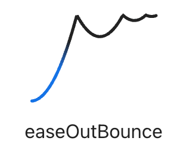

## motion

运动效果

  

svelte/motion

导出了两个方法tween和spring
  

### tween

  

tweened 补间动画

补间（动画）（来自 [in-between](https://en.wikipedia.org/wiki/Inbetweening)）是一个概念，允许你以平滑的方式更改对象的属性。你只需告诉它哪些属性要更改，当补间结束运行时它们应该具有哪些最终值，以及这需要多长时间，补间引擎将负责计算从起始点到结束点的值。

  补间动画（Tweened）的状态会在固定的时间间隔内不断更新其值

缓动方程https://web.archive.org/web/20190805215728/http://robertpenner.com/easing/

  

https://matthewlein.com/tools/ceaser

  

```html
<script>
  import { tweened } from "svelte/motion";

  import { cubicOut } from "svelte/easing";

  const size = tweened(1, {
    duration: 400,

    easing: cubicOut,
  });

  const handleClick = () => {
    $size += 1;
  };
</script>

<button on:click={handleClick}> scale </button>

<div style="transform: scale({$size}); transform-origin: 0 0">hello world</div>
```

  

演示一个progress的动画

```

<script>

import { writable } from 'svelte/store';

  

const progress = writable(0);

</script>

  

<style>

progress { display: block; width: 100%; }

</style>

  

<progress value={$progress}></progress>

  

{#each [0, 0.25, 0.5, 0.75, 1] as p}

<button on:click={() => $progress = p}>

{p*100}%

</button>

{/each}

```

  

options

  

delay：补间延迟多少毫秒之后开始

duration：补间效果的持续实践（以毫秒为单位），或者用一个 (from, to) => milliseconds 函数，可让你指定长实践补间缓动，以进行较大的值更改。

easing：一个 p => t 函数

interpolate：一个自定义的 (from, to) => t => value 函数，用于在任意值之间进行插值。默认情况下，Svelte 将在数字、日期以及形式近似的数组和对象之间进行插值（只要它们仅包含数字和日期，或其他有效的数组和对象）。如果要插值，比方说，颜色字符串或者变换矩阵，应该提供一个自定义插值器。

  

d3-interpolate 动画渐变

  

使用其他tween库完成的补间动画 [tween.js](https://github.com/tweenjs/tween.js/tree/main)

  

```html

<script>
  import { tweened } from "svelte/motion";

  import { cubicOut } from "svelte/easing";

  import * as TWEEN from "@tweenjs/tween.js";

  const size = tweened(1, {
    duration: 400,

    easing: cubicOut,
  });

  const obj = {
    value: 1,
  };

  let size2 = obj.value;

  const tween = new TWEEN.Tween(obj)

    .easing(TWEEN.Easing.Cubic.Out)

    .to({ value: 2 }, 400)

    .onUpdate(function (obj) {
      size2 = obj.value;
    });

  const handleClick = () => {
    $size += 1;

    tween.start();
  };

  animate();

  function animate() {
    if (size2 === 2) {
      tween.stop();

      return;
    }

    tween.update();

    requestAnimationFrame(animate);
  }
</script>

<button on:click|once={handleClick}> scale </button>

<!-- <div style="transform: scale({$size}); transform-origin: 0 0">
  
  hello world
  
  </div> -->

<div style="transform: scale({size2}); transform-origin: 0 0">hello world2</div>
```

  

### spring

  

>Spring animations are a wonderful way to make UI interactions come to life. Rather than merely changing a property at a constant rate over a period of time, springs allow us to move things using spring physics, which gives the impression of a real thing moving, and can appear more natural to users.


spring 弹性

  `spring` 状态根据指定的阻尼（`damping`）和刚度（`stiffness`）参数逐渐改变其目标值。我们知道 `tweened` 补间动画的状态是在固定的时间内变化其值的。

而 `spring` 弹簧动画的状态值，则由它现在的速度在确定的持续时间内变化，因此在进行更贴近自然运动的情况下用得较多

- `stiffness`（`number`，默认 `0.15`）— 表示刚度，其值介于 `0` 和 `1` 之间，值越高表示弹簧越“紧”。
- `damping`（`number`，默认 `0.8`）— 表示阻尼，其值介于 `0` 和 `1` 之间，值越低表示弹跳阻尼越小。
- `precision`（`number`，默认 `0.001`）— 表示精度，弹跳被认为处于静止状态的阈值，越低则越精确。

framer-motion

  

阻尼值

  

查看此文章：https://juejin.cn/post/6934657845094776845?searchId=20240129103216BAF31F6D4DB2109F6522

  
## easing
### ease

  

cubis-bezier贝塞尔曲线

[timing-function](https://tympanus.net/codrops/css_reference/timing-function_value/)

  

timing-function ease-function 数学函数

  

transition-timing-function: `<timing-function>`

animation-timing-function: `<timing-function>`

  

介绍timing-function的各属性值

  

在CSS中支持使用3种方式来定义一个函数:1、使用预定义的关键字。2、使用步进函数。3、使用cubic-bezier函数（三次贝兹曲线函数）

  

css中的

```

ease: cubic-bezier(0.25, 0.1, 0.25, 1.0)

linear: cubic-bezier(0.0, 0.0, 1.0, 1.0)

ease-in: cubic-bezier(0.42, 0, 1.0, 1.0)

ease-out: cubic-bezier(0, 0, 0.58, 1.0)

ease-in-out: cubic-bezier(0.42, 0, 0.58, 1.0)

```

  

```

<timing-function> = ease | linear | ease-in | ease-out | ease-in-out |

step-start | step-end | steps(<integer>[, [ start | end ] ]?) |

cubic-bezier(<number>, <number>, <number>, <number>)

</number></number></number></number></integer></timing-function>

```

  

todo: 看一下源码，对照一些数学公式，https://easings.net/

https://developer.mozilla.org/zh-CN/docs/Web/CSS/easing-function

使用自定义贝塞尔来实现动效和用css的timing-function来实现，看效果是否一致

  

比如我们选择easeOutBounce



它对应的公式如下

```javascript

function easeOutBounce(x: number): number {

const n1 = 7.5625;

const d1 = 2.75;

  

if (x < 1 / d1) {

return n1 * x * x;

} else if (x < 2 / d1) {

return n1 * (x -= 1.5 / d1) * x + 0.75;

} else if (x < 2.5 / d1) {

return n1 * (x -= 2.25 / d1) * x + 0.9375;

} else {

return n1 * (x -= 2.625 / d1) * x + 0.984375;

}

}

```

再看packages/svelte/src/runtime/easing/index.js中的

```javascript

/**

* https://svelte.dev/docs/svelte-easing

* @param {number} t

* @returns {number}

*/

export function bounceOut(t) {

const a = 4.0 / 11.0;

const b = 8.0 / 11.0;

const c = 9.0 / 10.0;

const ca = 4356.0 / 361.0;

const cb = 35442.0 / 1805.0;

const cc = 16061.0 / 1805.0;

const t2 = t * t;

return t < a

? 7.5625 * t2

: t < b

? 9.075 * t2 - 9.9 * t + 3.4

: t < c

? ca * t2 - cb * t + cc

: 10.8 * t * t - 20.52 * t + 10.72;

}

```

  

## transition

  

过渡效果

  

### transition:*fn*

  

svelte/transition

  

fade

blur

fly

slide

scale

draw

  

### in: *fn* /out:*fn*

  

我们可以监听以下过渡效果的事件：

  

introstart：进入效果开始

introend：进入效果结束

outrostart：退出效果开始

outroend：退出效果结束

  

## animation

  

动画

  

#### animate:*fn*

  
  

## 小结

tweened() 與 spring() 都有著與 store 相同的 set()、update() 方法，實際上，tweened() 與 spring() 就是上一集介紹過的 custom store

Tweening 指的是起末兩狀態間的過渡狀態，Svelte 提供了 tweened() 幫我們處理掉 tweening 的工作

Tweening 中間的過渡模式稱為 easing，有許多業界既有的 easing 模式可選用

spring() 一樣是處理過渡狀態，並且是產生 Q 彈的彈簧效果