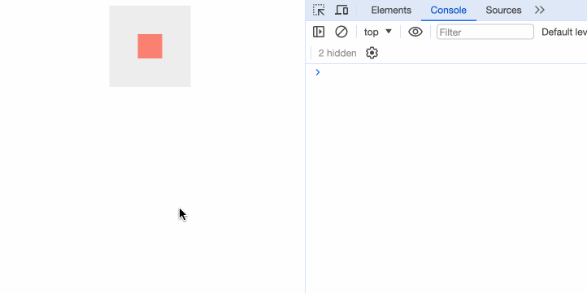
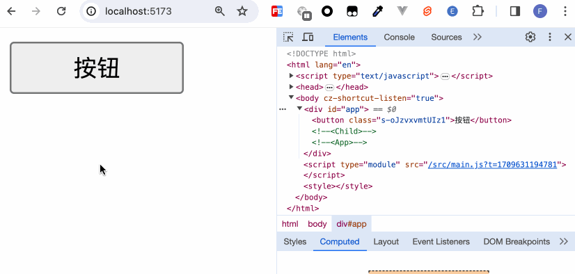

## 动作

svelte/action只是创建元素时调用的普通JavaScript 函数，通过这个函数，我们能够拿到对元素本身的引用，因此我们可以通过js编程将任何行为附加到该元素。可以理解为在元素的生命周期内进行操作。

一个普通的action用法如下：
```javascript
use:action={parameters}
```

action动作即我们上述所说的js函数，它的定义如下：
```javascript
action = (node: HTMLElement, parameters: any) => {
  update?: (parameters: any) => void,
  destroy?: () => void
}
```
node参数即元素的引用，parameters参数即`={parameters}`的值。
update方法会在元素每次更新时都调用。
destroy方法在元素销毁时调用。

action只能在正常元素中使用，无法在组件中使用：
![[Pasted image 20240313111641.png]]

```html
<script>
  function greet(node, params) {
    console.log('hello', params);
  }
</script>

<div use:greet={'app页面'}>app</div>
```

![[Pasted image 20240313111747.png]]
笔者会为大家带来三个自定义action的演示：分别是`use:clickoutside`、`use:wave`和`use:space`。

 #### clickoutside

```javascript
export const clickOutside = (node: HTMLElement, callback: () => void) => {
  const handleClick = (event: MouseEvent) => {
    if (!event?.target) return;

    if (
      node &&
      !node.contains(event.target as Node) &&
      !event.defaultPrevented
    ) {
      callback();
    }
  };

  document.addEventListener("click", handleClick, true);

  return {
    destroy() {
      document.removeEventListener("click", handleClick, true);
    },
  };
};
```
如果你没有使用Typescript，可以把例子中的类型定义给删除。

```html
<script>
  import { clickOutside } from './action';

  const onClickOutside = () => {
    console.log('点击外面');
  }
</script>

<main>
  <div id="box" use:clickOutside={onClickOutside}></div>
</main>

<style>
  main {
    width: 100px;
    height: 100px;
    background: #eeeeee;
    margin: 0 auto;
    display: flex;
    align-items: center;
    justify-content: center;
  }
  #box {
    width: 30px;
    height: 30px;
    background: salmon;
    line-height: 30px;
    text-align: center;
  }
</style>
```


当我们点击红色区域时，不会打印任何信息，点击红色区域以外，打印出信息。

#### wave

```javascript
export function wave(ele) {
  let clickWaveTimeoutId;
  let styleForPesudo;

  function getAttributeName() {
    return 'ant-click-animating-without-extra-node';
  }

  function _onClick(node, waveColor) {
    const attributeName = getAttributeName();
    node.removeAttribute(attributeName);
    node.setAttribute(attributeName, 'true');

    styleForPesudo = styleForPesudo || document.createElement('style');
    if (waveColor) {
      styleForPesudo.innerHTML =
        `[ant-click-animating-without-extra-node]:after { border-color: ${waveColor}; }`;
      if (!document.body.contains(styleForPesudo)) {
        document.body.appendChild(styleForPesudo);
      }
    }
    node.addEventListener('animationend', onTransitionEnd);
  }

  function bindAnimationEvent(node) {

    const onClick = (e) => {
      resetEffect(node);
      const waveColor =
        getComputedStyle(node).getPropertyValue('border-top-color') || // Firefox Compatible
        getComputedStyle(node).getPropertyValue('border-color') ||
        getComputedStyle(node).getPropertyValue('background-color');
      clickWaveTimeoutId = window.setTimeout(() => _onClick(node, waveColor), 0);
    };

    node.addEventListener('click', onClick, true);

    return {
      cancel: () => {
        node.removeEventListener('click', onClick, true);
      },
    };
  }

  function resetEffect(node) {
    const attributeName = getAttributeName();
    node.removeAttribute(attributeName);
    removeExtraStyleNode();

    node.removeEventListener('animationend', onTransitionEnd);
  }

  function onTransitionEnd(e) {
    if (!e || e.animationName !== 'fadeEffect') {
      return;
    }
    resetEffect(e.target);
  }

  function removeExtraStyleNode() {
    if (styleForPesudo) {
      styleForPesudo.innerHTML = '';
    }
  }

  bindAnimationEvent(ele);

  return {
    destroy() {
      if (clickWaveTimeoutId) {
        clearTimeout(clickWaveTimeoutId);
      }
    }
  }
}
```

```html
<script>
  import { wave } from "./action";
</script>

<button use:wave>按钮</button>

<style>
  button {
    width: 100px;
    height: 30px;
  }
</style>
```

因为Svelte组件内的style是scoped限制的，我们将以下样式代码放到全局：
```css
:root {
  --theme-color: purple;
}

[ant-click-animating-without-extra-node="true"] {
  position: relative;
}

[ant-click-animating-without-extra-node="true"]::after {
  position: absolute;
  top: 0;
  right: 0;
  bottom: 0;
  left: 0;
  display: block;
  border-radius: inherit;
  box-shadow: 0 0 0 0 var(--theme-color);
  opacity: 0.2;
  animation: fadeEffect 2s cubic-bezier(0.08, 0.82, 0.17, 1),
    waveEffect 0.4s cubic-bezier(0.08, 0.82, 0.17, 1);
  animation-fill-mode: forwards;
  content: "";
  pointer-events: none;
}

@keyframes waveEffect {
  100% {
    box-shadow: 0 0 0 var(--theme-color);
    box-shadow: 0 0 0 6px var(--theme-color);
  }
}

@keyframes fadeEffect {
  100% {
    opacity: 0;
  }
}
```



这样我们在不改动原有组件逻辑的情况下，便可以通过使用`use:wave`来添加点击波浪的效果。因此，use非常适合用于拓展一些组件、甚至是第三方库的功能。

https://github.com/ant-design/ant-design/blob/3.26.20/components/style/core/motion/other.less

https://github.com/ant-design/ant-design/blob/3.26.20/components/_util/wave.tsx

#### space
在前面介绍《插槽》的章节中，我们了解到，在Svelte中并不能劫持`$$slots`来二次定义插槽的内容，那我们便可以使用指令的形式来完成这一操作。
```javascript
// action.js
export function space(node: HTMLElement, spaceClasses: string) {
  const wrap = () => {
    node.childNodes.forEach((element) => {
      if (!element) {
        return;
      }

      if (
        element.nodeType === 3 &&
        (!element.nodeValue || /^\s+$/.test(element.nodeValue))
      ) {
        return;
      }

      if (element.parentNode) {
        const wrapItem = document.createElement("div");

        wrapItem.className = spaceClasses;

        element.parentNode.insertBefore(wrapItem, element);

        wrapItem.appendChild(element);
      }
    });
  };

  wrap();

  return {
    destroy: wrap,
  };
}
```

之后我们在Space组件中使用space的action：
```html
<script>
// Space.svelte
  import { space } from "./action"
  let spaceChildClass = "ant-space-item";

  let spaceClass = "ant-space";
</script>

<div use:space={spaceChildClass} class={spaceClass}>
  <slot />
</div>

<style>
  .ant-space {
    display: flex;
  }
  :global(.ant-space .ant-space-item){
    margin-right: 4px;
  }
  :global(.ant-space-item:last-child) {
    margin-right: 0;
  }
</style>
```

在App中测试一下：
```html
<script>
  import Space from './Space.svelte';
</script>

<Space>
  <div>item1</div>
  <h2>item2</h2>
  <span>item3</span>
</Space>
```
![[Pasted image 20240313113253.png]]
## 其他

除了使用use来实现自定义的动作，Svelte还支持其他指令。如在介绍数据与dom引用时的`bind:`，在动画章节介绍的`transition:`、`in:`、`out:`、`animate:`以及在样式章节介绍的`style:`。

## 小结

本章演示了三个自定义的指令，了解了指令的作用。