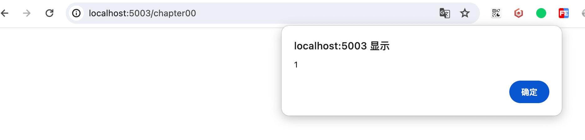
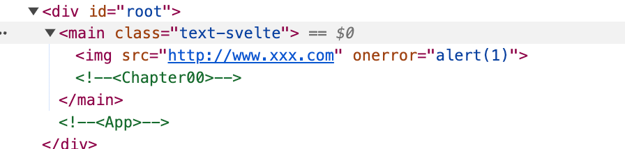
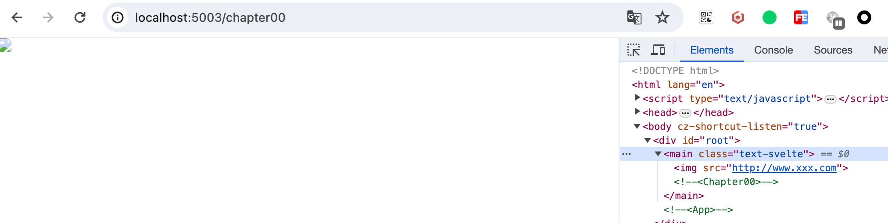

## await

在列表展示时，为了提升用户体验，我们在数据请求的过程中，往往会使用一些loading toast来提示用户我们正在请求，等到请求完成后便会隐藏loading提示而展示我们请求成功的数据。

我们Svelte有自己的Suspense！

```
{#await expression}...{:then name}...{:catch name}...{/await}
```

  

react suspense

  

vue3 suspense

  
## html

```javascript
{@html expression}
```

  需要对html内容进行转义

  

Svelte不会在注入HTML之前转义表达式。如果数据来源不受信任，则必须对其进行转义，否则将用户暴露于XSS漏洞之中。

举个例子：
```html
<script>
  const htmlContent = '';
</script>

{@html htmlContent}
```






  

过滤 xss防御库

https://www.npmjs.com/package/xss

https://github.com/cure53/DOMPurify


```html
<script>
  import xss from "xss";

  const htmlContent = '';

  const filterContent = xss(htmlContent);
</script>

{@html filterContent}
```



## key

```
{#key}
```


```

<script>

import { fly } from 'svelte/transition';

let data = [{ id: 0, value: Math.floor(Math.random() * 100) }];

  

function add() {

const randomIndex = Math.round(Math.random() * data.length);

data = [

...data.slice(0, randomIndex),

{ id: data.length, value: Math.floor(Math.random() * 100) },

...data.slice(randomIndex)

];

}

function remove() {

const randomIndex = Math.floor(Math.random() * data.length);

data = [

...data.slice(0, randomIndex),

...data.slice(randomIndex + 1)

];

}

</script>

  

<button on:click={add}>Randomly Add</button>

<button on:click={remove}>Randomly Remove</button>

  

{#each data as item (item.id)}

<div transition:fly={{y: 10}}>{ item.id } { item.value }</div>

{/each}

```

可以通过渐变的块得知哪些被复用，哪些被删除。todo 重写

  
  

```html

<script>

import { fly } from 'svelte/transition';

  

let number = 0;

</script>

  

<div>

The number is:

{#key number}

<span style="display: inline-block" in:fly={{ y: -20 }}>

{number}

</span>

{/key}

</div>

<br />

<button

on:click={() => {

number += 1;

}}

>

Increment

</button>

  

```

  

Key blocks destroy and recreate their contents when the value of an expression changes.This is useful if you want an element to play its transition whenever a value changes instead of only when the element enters or leaves the DOM.

## debug
```

{@debug}

```

打开控制台时，会出现调试断点，且当我们改变变量的值时，debug会再次被唤醒

  
## const
```

{@const}

```

## 小结