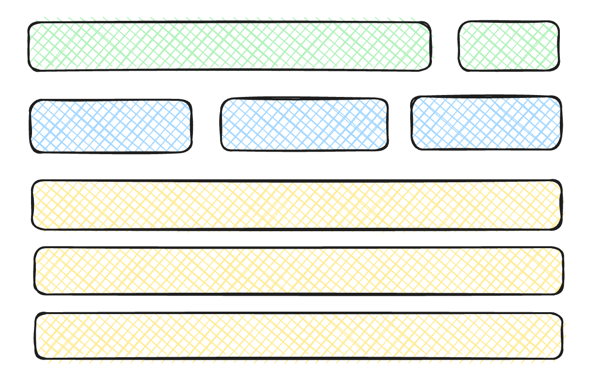
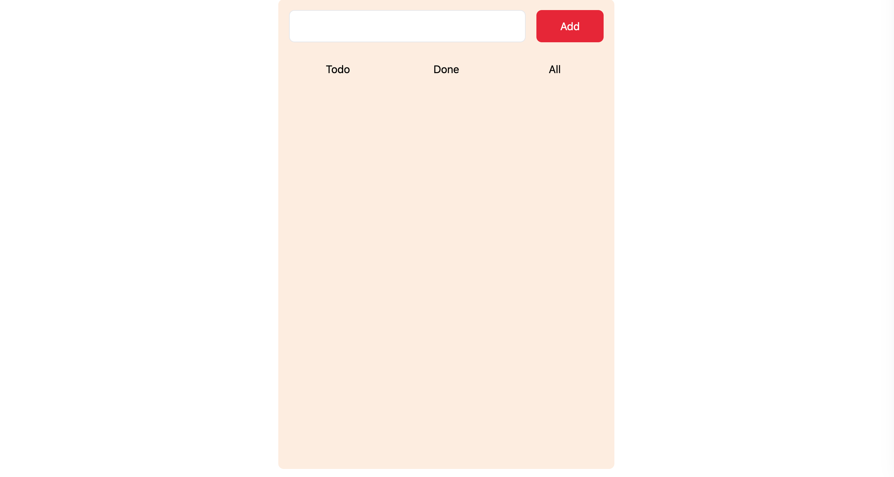

## 搭建环境

首先使用vite搭建项目。
```bash
npm create vite@latest svelte-todolist -- --template svelte
```

安装tailwind，读者可自行选择自己喜欢的样式工具

```bash
npm install -D tailwindcss postcss autoprefixer
```

```bash
npx tailwindcss init -p
```

删除lib/Counter.svelte，清空App.svelte的内容，清空app.css的内容。

将tailwind的基本内容添加进app.css
```css
@tailwind base;
@tailwind components;
@tailwind utilities;
```

修改tailwind.config.js的内容
```javascript
/** @type {import('tailwindcss').Config} */
export default {
  content: ["./src/**/*.{html,js,svelte}"],
  theme: {
    extend: {},
  },
  plugins: [],
}
```

然后我们往App.svelte里添加一行内容
```html
<div class="text-rose-400">app</div>
```
如无意外，相信读者朋友们能在页面上看到玫瑰色的app字样。


从[dribble](https://dribbble.com/shots/12342455-ToDo-List-042-DailyUI)上吸取灵感，挑选了一些好看的颜色。在tailwind.config.js上配置
```javascript
/** @type {import('tailwindcss').Config} */
export default {
  content: ["./src/**/*.{html,js,svelte}"],
  theme: {
    extend: {
      colors: {
        'color1': '#FDEEE1',
        'color2': '#E62737',
        'color3': '#FF7171',
        'color4': '#FFADA8',
      }
    },
  },
  plugins: [],
}```

## 数据结构

首先我们需要确定待办列表的一个待办项的数据结构，目前笔者定义如下
```typescript
interface Todo {
	id: number,
	text: string,
	done: boolean,
}
```

## 布局

我们将页面分成三部分，笔者在这里用不同的颜色进行了标注。分别是输入框、Tab切换以及待办列表展示。
整体使用flex布局。

## 基本框架
在App.svelte中
```html
<script>
  let divClass =
    "flex flex-col w-[500px] h-[700px] overflow-hidden rounded-lg mx-auto p-4 bg-black";
</script>

<div class={divClass}></div>
```
在页面上，看到一个居中的暖色块。

### 输入框
新建一个Input.svelte文件，内容如下
```html
<script>
  let inputClass = "flex-1 h-full border rounded-lg mr-4 px-4 caret-color2 focus:outline-color2";
  let buttonClass = "w-[100px] h-full rounded-lg flex items-center justify-center bg-color2 text-white flex-shrink-0 hover:cursor-pointer"
</script>

<div class="flex h-12">
  <input
    type="text"
    class={inputClass}
  />
  <button
    class={buttonClass}>Add</button
  >
</div>```

然后我们在App.svelte中引入该组件
```html
<script>
  import Input from './Input.svelte';

  let divClass =
    "flex flex-col w-[500px] h-[700px] overflow-hidden rounded-lg mx-auto p-4 bg-color1";
</script>

<div class={divClass}>
  <Input />
</div>```
此时相信读者们能够看到以下内容：

### Tabs
新建Tabs.svelte组件，添加内容：
```html
<script>
  let tabsClass = "grid grid-cols-3 gap-4 h-12 my-4";
  let tabClass =
    "h-12 flex items-center justify-center hover:cursor-pointer rounded-lg";
</script>

<div class={tabsClass}>
  <button class={tabClass}>Todo</button>
  <button class={tabClass}>Done</button>
  <button class={tabClass}>All</button>
</div>
```
App.svelte中引入该组件后，页面展示如下：


继续完善Tabs.svelte的内容：
```javascript
<script>
  let tabsClass = "grid grid-cols-3 gap-4 h-12 my-4";
  let tabClass =
    "h-12 flex items-center justify-center hover:cursor-pointer rounded-lg";

  let currentTab = 'todo'; // todo | done | all

  const changeTab = (tab) => currentTab = tab;
</script>

<div class={tabsClass}>
  <button class={tabClass} on:click={() => changeTab('todo')}>Todo</button>
  <button class={tabClass} on:click={() => changeTab('done')}>Done</button>
  <button class={tabClass} on:click={() => changeTab('all')}>All</button>
</div>
<div class="flex-1 overflow-auto">
  <slot>{currentTab}</slot>
</div>
```
笔者设置了currentTab变量，用来记录当前激活的是哪个tab，为三个tab按钮绑定更新tab的事件，然后添加了slot，用于待办列表的展示

### 列表

首先我们实现Item.svelte内的展示
```html
<script>
  export let index = 0;
  export let name = "";
  export let done = false;

  let divClass =
    "flex items-center bg-white rounded-lg h-12 px-4 mb-4";
  let indexClass = "w-12 text-left flex-shrink-0";
  let nameClass = "flex-1 overflow-hidden text-ellipsis";
  let checkboxWrapClass = "w-12 flex-shrink-0 flex justify-end items-center";
</script>

<div class={divClass}>
  <span class={indexClass}>{index}</span>
  <span class={nameClass}>{name}</span>
  <span class={checkboxWrapClass}>
    <input
      type="checkbox"
      checked={done}
    />
  </span>
</div>

<style>
  input[type="checkbox"] {
    appearance: none;
    background-color: #fff;
    margin: 0;
    font: inherit;
    width: 1.15em;
    height: 1.15em;
    border: 0.15em solid currentColor;
    border-radius: 0.15em;
    transform: translateY(-0.075em);
    display: grid;
    place-content: center;
  }

  input[type="checkbox"]::before {
    content: "";
    width: 0.65em;
    height: 0.65em;
    transform: scale(0);
    transition: 120ms transform ease-in-out;
    box-shadow: inset 1em 1em #E62737;
  }

  input[type="checkbox"]:checked::before {
    transform: scale(1);
  }
</style>
```
待办项Item.svelte接收三个prop：index、name和done。
这里我们用自己的style重写了checkbox的样式，使其看上去更符合我们页面的主题。

接着我们实现List.svelte的内容：
```html
<script>
  import Item from './Item.svelte';

  let list = [{
    id: 1,
    text: 'hello',
    done: false
  }, {
    id: 2,
    text: 'world',
    done: true
  }];
</script>

{#each list as {text, done}, i}
  <Item index={i} name={text} done={done} />
  {:else}
    No data
{/each}
```
这里我们mock了两个待办项的假数据，一个状态未完成，另一个状态已完成。
最后，我们在App.svelte中引用List.svelte并使用它。
```html
<script>
  import Input from './Input.svelte';
  import Tabs from './Tabs.svelte';
  import List from './List.svelte';

  let divClass =
    "flex flex-col w-[500px] h-[700px] overflow-hidden rounded-lg mx-auto p-4 bg-color1";
</script>

<div class={divClass}>
  <Input />
  <Tabs>
    <List />
  </Tabs>
</div>
```

至此，页面上能够看见我们最开始设计的布局结构。


当然，此时的页面功能仍不完整，比如无法添加待办项、Tab切换没有样式、待办项勾选后没有放置到对应的Tab栏等等。在下一章，我们将完善剩余的功能。

## 小结