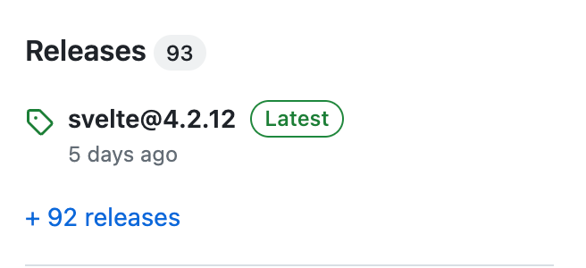
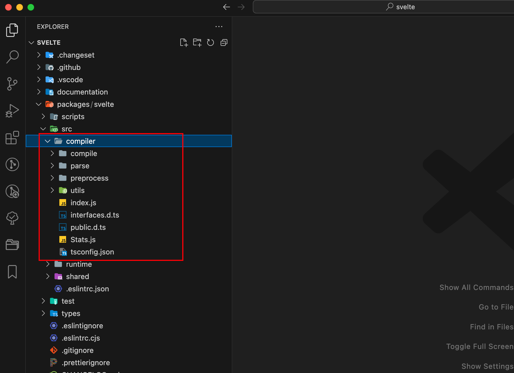

https://pic1.zhimg.com/80/v2-5de464e8217c79ab0a12a279ee7cf42c_1440w.webp
https://github.com/forthealllight/blog/issues/71
https://github.com/Jarweb/thinking-in-deep/issues/15

经过了前两章的铺垫，我们正式开始对源码进行解读。到笔者目前写此文章时（2024-02-28），Svelte的最新版本是4.2.12


笔者不会对源码过于细致的讲解，因为如果需要对每个细节都进行解读，那完全可以再开一本小册单独讲解了。

svelte-loader: https://github.com/sveltejs/svelte-loader/blob/master/index.js
vite-plugin-svelte: https://github.com/sveltejs/vite-plugin-svelte/blob/main/packages/vite-plugin-svelte/src/utils/compile.js

TODO: https://zhuanlan.zhihu.com/p/409291132

svelte 官方的 webpack 插件[svelte-loader](https://github.com/sveltejs/svelte-loader)和 rollup 插件[rollup-plugin-svelte](https://github.com/sveltejs/rollup-plugin-svelte)的主要都是基于 svelte.compile，这个编译器主要分为两部分 parse 和 compile，parse 是解析的过程，解析 script 和 style 等 tag 标签以及 each 和 ifelse 等 mustache 模版语法。compile 则是包含了 parse 的动作，将解析出来的 ast 语法树转换为可执行的代码

在 svelte 源码里，使用了 acorn 将 javascript 编译成 ast 树，然后对 javascript 的语义解释过程做了额外的工作：

* 编译赋值语句时，除了生成对应的赋值逻辑，额外生成数据更新逻辑代码
* 编译变量声明时，变量被编译成上下文数组
* 编译模板时，标记依赖，并对每个变量引用生成更新逻辑

svelte 组件使用create, mount, patch, destroy 这四个方法实现对 DOM 视图的操作。

* create 负责组件dom的创建
* mount 负责将 dom 挂载到对应的父节点上
* patch 负责根据数据的变化更新 dom
* destroy 负责销毁对应的 dom
* 首先解析 svelte 模板并生成模板 AST
* 然后遍历模板 AST
* * 如果碰到普通的 html tag 或者文本，输出 dom 创建语句（dom.createElement)
  * 如果碰到变量
  * * 转换为上下文引用方式并输出取值语句（如： name 被生成为 ctx[/** name */0])
    * 在 patch 函数中生成对应的更新语句
  * 如果碰到 if 模板
  * * 获取 condition 语句，输出选择函数 select_block （子模板选择器）
    * 获取 condition 为 true 的模板片段，输出 if_block 子模板构建函数
    * 获取 condition 为 false 的模板片段，输出 else_block 子模板构建函数
  * 如果碰到 each 模板
  * * 获取循环模板片段，生成块构建函数 create_each_block
    * 根据循环内变量引用，生成循环实例上下文获取 get_each_block_context
* 生成 key获取函数 get_key
* 生成基于key更新列表的patch逻辑函数 update_keyed_each


把项目下载下来，切换到4.2.12分支。

```bash
git clone git@github.com:sveltejs/svelte.git
```


在compiler目录下
compile
parse
preprocess

### compile
packages/svelte/src/compiler/compile/index.js
```javascript
/**
 * `compile` takes your component source code, and turns it into a JavaScript module that exports a class.
 *
 * https://svelte.dev/docs/svelte-compiler#svelte-compile
 * @param {string} source
 * @param {import('../interfaces.js').CompileOptions} options
 */
export default function compile(source, options = {}) {
	const ast = parse(source, options);
	const component = new Component(
		ast,
		source,
		options.name || get_name_from_filename(options.filename) || 'Component',
		options,
	);
	const result = render_dom(component, options);
	return component.generate(result);
}
```
我们去掉不相关的代码，可以看到基本的compile逻辑。

通过解读svelte文件的字符串内容，得到ast，将ast转成Component类，然后render dom，最后generate。

### parse

```javascript
export default function parse(template, options = {}) {
	const parser = new Parser(template, options);
	
	const instance_scripts = parser.js.filter((script) => script.context === 'default');
	const module_scripts = parser.js.filter((script) => script.context === 'module');

	return {
		html: parser.html,
		css: parser.css[0],
		instance: instance_scripts[0],
		module: module_scripts[0]
	};
}
```

#### Parser

##### fragment
```javascript
import tag from './tag.js';
import mustache from './mustache.js';
import text from './text.js';

/**
 * @param {import('../index.js').Parser} parser
 */
export default function fragment(parser) {
	if (parser.match('<')) {
		return tag;
	}

	if (parser.match('{')) {
		return mustache;
	}

	return text;
}
```
##### tag

##### mustache

##### text


### Component
#### Fragment
```javascript
export default class Fragment extends Node {
	/** @type {import('../render_dom/Block.js').default} */
	block;

	/** @type {import('./interfaces.js').INode[]} */
	children;

	/** @type {import('./shared/TemplateScope.js').default} */
	scope;

	/**
	 * @param {import('../Component.js').default} component
	 * @param {import('../../interfaces.js').TemplateNode} info
	 */
	constructor(component, info) {
		const scope = new TemplateScope();
		super(component, null, scope, info);
		this.scope = scope;
		this.children = map_children(component, this, scope, info.children);
	}
}
```
map_children
```javascript
export default function map_children(component, parent, scope, children) {
	let last = null;
	let ignores = [];
	return children.map((child) => {
		const constructor = get_constructor(child.type);
		const use_ignores = child.type !== 'Text' && child.type !== 'Comment' && ignores.length;
		if (use_ignores) component.push_ignores(ignores);
		const node = new constructor(component, parent, scope, child);
		if (use_ignores) component.pop_ignores(), (ignores = []);
		if (node.type === 'Comment' && node.ignores.length) {
			push_array(ignores, node.ignores);
		}
		if (last) last.next = node;
		node.prev = last;
		last = node;
		return node;
	});
}
```

get_constructor经过new得到一个node对象
```javascript
function get_constructor(type) {
	switch (type) {
		case 'AwaitBlock':
			return AwaitBlock;
		case 'Body':
			return Body;
		case 'Comment':
			return Comment;
		case 'ConstTag':
			return ConstTag;
		case 'Document':
			return Document;
		case 'EachBlock':
			return EachBlock;
		case 'Element':
			return Element;
		case 'Head':
			return Head;
		case 'IfBlock':
			return IfBlock;
		...
		default:
			throw new Error(`Not implemented: ${type}`);
	}
}```
### render_dom
#### Renderer

## 小结