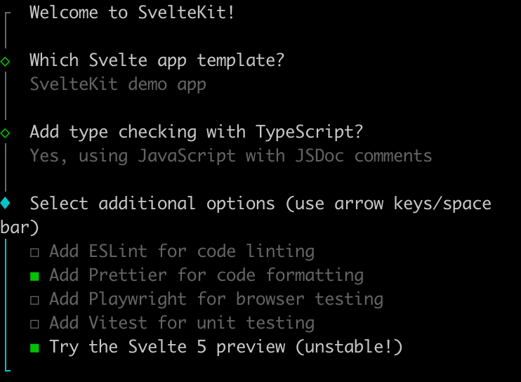
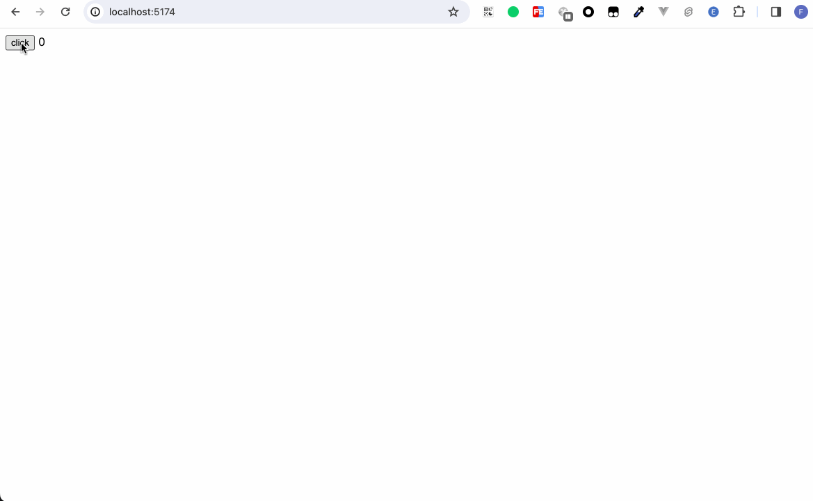
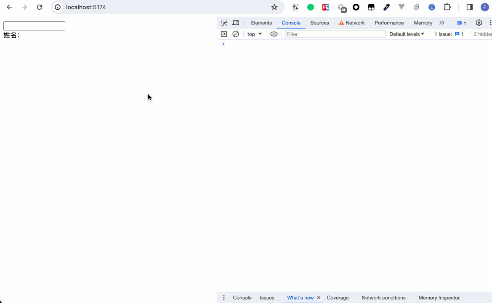
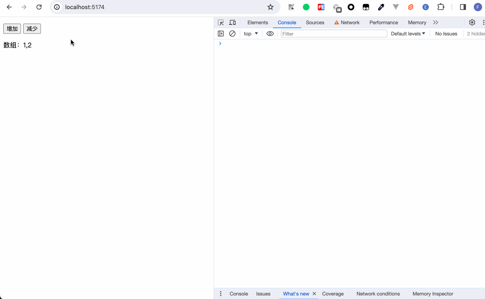
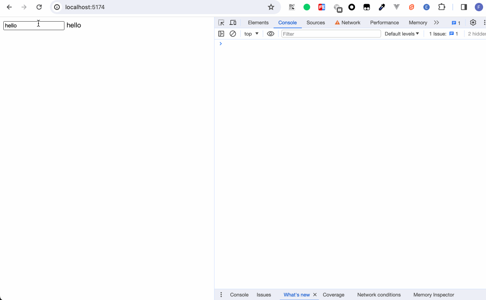
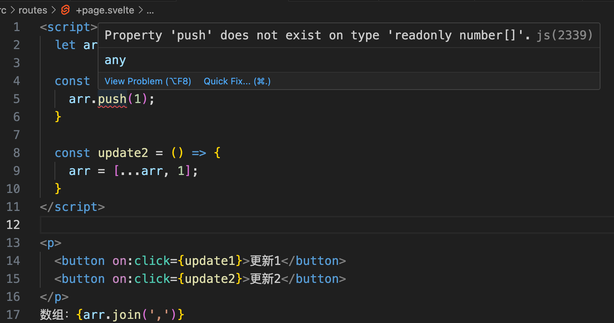
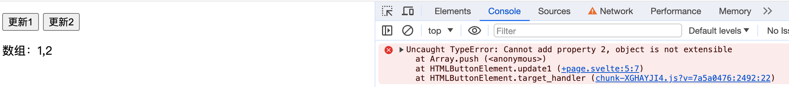
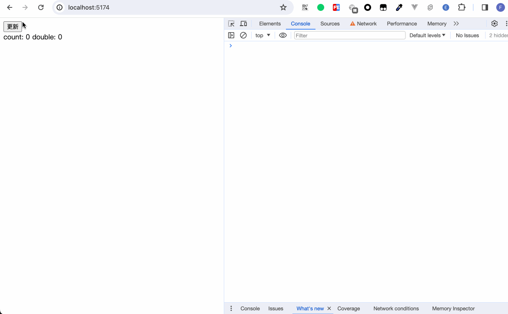

# Svelte5 抢先看！

```bash
npm create svelte@latest  svelte-5
```

```
┌  Welcome to SvelteKit!
│
◆  Which Svelte app template?
│  ● SvelteKit demo app (A demo app showcasing some of
the features of SvelteKit - play a word guessing game
that works without JavaScript!)
│  ○ Skeleton project
│  ○ Library project
└
```



```bash
cd svelte-5
npm install 
npm run dev
```


package.json里的依赖显示
```json
{
  "svelte": "^5.0.0-next.1",
}
```

https://svelte-5-preview.vercel.app/docs/introduction
https://svelte.dev/blog/runes

引入了Runes。

REPL 体验 https://svelte-5-preview.vercel.app/

## Runes
Runes是一组函数式的符号，无需额外引入，可以直接使用，是Svelte5语言的特性。

### `$state`
```html
<script>
	let count = $state(0);
</script>

<button on:click={() => count++}>
	click
</button>
{count}
```


在class中也能使用
```html
<script>
	class Person {
		name = $state();

		constructor(name) {
			this.name = name;
		}
	}

	const person = new Person();
</script>

<input bind:value={person.name} /><br />
姓名：{person.name}
```



对比之前的数据声明，多了`$state`。

数组
```html
<script>
	const arr = $state([1,2]);

	const onAdd = () => {
		arr.push(1);
	}

	const onSub = () => {
		arr.pop();
	}
</script>

<p>
	<button on:click={onAdd}>增加</button>
	<button on:click={onSub}>减少</button>
</p>
数组：{arr.join(',')}
```


```html
<script>
	const obj = $state({
		foo: {
			bar: 'hello'
		}
	});

</script>

<input bind:value={obj.foo.bar} />
{obj.foo.bar}
```



### `$state.frozen`
```html
<script>
	let arr = $state.frozen([1,2]);

	const update1 = () => {
		arr.push(1);
	}

	const update2 = () => {
		arr = [...arr, 1];
	}
</script>

<p>
	<button on:click={update1}>更新1</button>
	<button on:click={update2}>更新2</button>
</p>
数组：{arr.join(',')}
```




当我们调用update2时，数组能正常更新。

浅拷贝？

### `$derived`
```html
<script>
	let count = $state(0);

	let double = $derived(count * 2);

	const onClick = () => {
		count++;
	}
</script>

<button on:click={onClick}>更新</button><br />
count: {count}
double: {double}
```


### `$derived.by`
接收一个函数

### `$effect`

### `$effect.pre`

beforeUpdate

### `$effect.active`

判断是否运行在`$effect`中

### `$effect.root`

### `$props`

## Snippets

## 事件监听
原来的事件监听形式是`on:eventname`，Svelte5改为`oneventname`

## 方法
### untrack
### unstate
### mount
### hydrate
### render