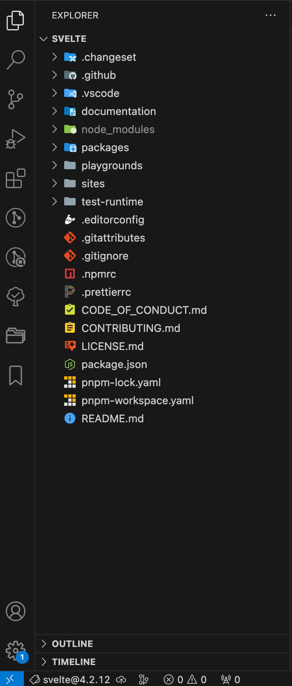
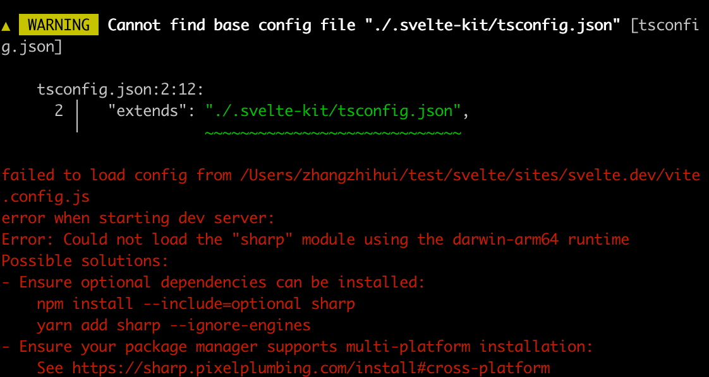

# Svelte5 抢先看！

## 安装
```bash
npm create svelte@latest  svelte-5
```

```
┌  Welcome to SvelteKit!
│
◆  Which Svelte app template?
│  ● SvelteKit demo app (A demo app showcasing some of
the features of SvelteKit - play a word guessing game
that works without JavaScript!)
│  ○ Skeleton project
│  ○ Library project
└
```



```bash
cd svelte-5
npm install 
npm run dev
```


package.json里的依赖显示
```json
{
  "svelte": "^5.0.0-next.1",
}
```

https://svelte-5-preview.vercel.app/docs/introduction
https://svelte.dev/blog/runes

引入了Runes。符文
https://www.leagueoflegends.com/en-au/champions/ryze/


REPL 体验 https://svelte-5-preview.vercel.app/

## Runes
也许大家对Runes不太熟悉，但如果说到英雄联盟里的瑞兹，相信大家耳熟能详。瑞兹的英文全称是**THE RUNE MAGE**，中文翻译是符文法师。不错，Runes即符文。 
为了看起来更自然点，文章中将继续以Runes来说明。  
Runes是一组函数式的符号，无需额外引入，可以直接使用，是Svelte5语言的特性。

### `$state`
```html
<script>
	let count = $state(0);
</script>

<button on:click={() => count++}>
	click
</button>
{count}
```


在class中也能使用
```html
<script>
	class Person {
		name = $state();

		constructor(name) {
			this.name = name;
		}
	}

	const person = new Person();
</script>

<input bind:value={person.name} /><br />
姓名：{person.name}
```


对比之前的数据声明，多了`$state`。

数组
```html
<script>
	const arr = $state([1,2]);

	const onAdd = () => {
		arr.push(1);
	}

	const onSub = () => {
		arr.pop();
	}
</script>

<p>
	<button on:click={onAdd}>增加</button>
	<button on:click={onSub}>减少</button>
</p>
数组：{arr.join(',')}
```


```html
<script>
	const obj = $state({
		foo: {
			bar: 'hello'
		}
	});

</script>

<input bind:value={obj.foo.bar} />
{obj.foo.bar}
```


### `$state.frozen`
```html
<script>
	let arr = $state.frozen([1,2]);

	const update1 = () => {
		arr.push(1);
	}

	const update2 = () => {
		arr = [...arr, 1];
	}
</script>

<p>
	<button on:click={update1}>更新1</button>
	<button on:click={update2}>更新2</button>
</p>
数组：{arr.join(',')}
```



当我们调用update2时，数组能正常更新。

浅拷贝？

### `$derived`
`$derived`接收一个参数，这个参数是一个没有副作用的表达式。
```html
<script>
	let count = $state(0);

	let double = $derived(count * 2);

	const onClick = () => {
		count++;
	}
</script>

<button on:click={onClick}>更新</button><br />
count: {count}
double: {double}
```


我们可以传`count * 2`，但是不能传`count++`。

在Svelte4中，我们要声明一个派生属性，需在`$: `里进行。

### `$derived.by`
接收一个函数。
```html
<script>
  let arr = $state([1,2,3]);
  let total = $derived.by(() => {
    return arr.reduce((pre, cur) => pre + cur, 0);
  });

  const onAdd = () => {
    arr.push(arr.length + 1);
  }
</script>

<button on:click={onAdd}>add</button>
total: {total}
```


### `$effect`
> runs when the component is mounted, and again whenever `count` or `doubled` change,after the DOM has been updated.
因此，`$effect`相当于`$: {}`和`afterUpdate`的结合体。笔者对此改动表示热烈欢迎，因为本人始终觉得在有些框架中，一个组件对外提供一大串又丑又长的生命周期，着实加大了开发者的心智负担。

```html
<script>
  import { afterUpdate } from 'svelte';
  let width = 10;
  let height = 10;

  $: console.log('width改变', width);

  afterUpdate(() => {
    console.log('afterUpdate')
  });
</script>

width: <input type="number" bind:value={width} />
```


```html
<script>
  let width = $state(10);

  $effect(() => {
    console.log('width改变', width);
  });
</script>

width: <input type="number" bind:value={width} />
```


### `$effect.pre`

用于替代`beforeUpdate`生命周期。
```html
<script>
  import { beforeUpdate, afterUpdate } from 'svelte';
  let width = 10;

  beforeUpdate(() => {
    const dom = document.querySelector('#width');
    if (dom) {
      console.log('beforeUpdate', dom.innerHTML);
    }
  });

  afterUpdate(() => {
    const dom = document.querySelector('#width');
    if (dom) {
      console.log('afterUpdate', dom.innerHTML);
    }
  });
</script>

width: <input type="number" bind:value={width} />
<span id="width">{width}</span>
```


```html
<script>
  let width = $state(10);

  $effect.pre(() => {
    const dom = document.querySelector('#width');
    if (dom) {
      console.log('svelte5 beforeUpdate', dom.innerHTML, width);
    }
  })

  $effect(() => {
    const dom = document.querySelector('#width');
    if (dom) {
      console.log('svelte5 afterUpdate', dom.innerHTML, width);
    }
  });
</script>

width: <input type="number" bind:value={width} />
<span id="width">{width}</span>
```

在这里之所以要把width也一起打印出来，是因为`$effect`和`$effect.pre`的后续执行需要依赖width。

### `$effect.active`

官网给出的说明是用于判断是否在一个effect中或是否在template中
```html
<script>
  let count = $state(0);

  $effect(() => {
    console.log('effect', count);
    console.log('isActive in $effect', $effect.active());
  });

  $effect.pre(() => {
    console.log('pre', count);
    console.log('isActive in $effect.pre', $effect.active());
  });

  let double = $derived.by(() => {
    console.log('isActive in derived.by', $effect.active());
    return count * 2;
  })

  console.log('isActive no runes', $effect.active());
</script>

<input type="number" bind:value={count} />
double: {double}
in template:{console.log('isActive in template', $effect.active())}
```

经过试验，在`$effect`、`$effect.pre`和template中能够正常判断。  
我们尝试在`$derived.by`中使用，可是打印结果提醒我们`$effect.active`在其中并不适用。

### `$effect.root`

### `$props`
```html
<script>
  export let value;
</script>

子组件：{value}
```

```html
<script>
  let { value } = $props();
</script>

子组件：{value}
```

## Snippets

## 事件
### 事件监听
在演示Runes和Snippets时，笔者在使用到数据绑定时，仍旧使用的是Svelte4`on:eventname`的形式。其实在Svelte5中，关于方法的使用也有更新：从原来`on:eventname`的形式转变为`oneventname`的形式。

```diff
<script>
  const onClick = () => {
    console.log('click');
  }
</script>

- <button on:click={onClick}>click</button>
+ <button onclick={onClick}>click</button>
```

### 组件事件
使用`$props()`来接收方法。终于不用使用难用的`createEventDispatcher`了。

```html
<script>
  let { onClick, onClick2 } = $props();
</script>

<button onclick={onClick}>click</button>
<button onclick={e => onClick2('hello svelte')}>click2</button>
```

```html
<script>
	import Svelte5 from './Svelte5.svelte';

	const onClick = (event) => {
		console.log('event', event);
	}

	const onClick2 = (value) => {
		console.log('value', value);
	}
</script>

<Svelte5 {onClick} {onClick2} />
```


### 事件修饰符
Svelte4的事件修饰符如下：
```html
<button on:click|once|preventDefault={handler}>...</button>
```
像once、preventDefault、stopPropagation等需要自己手动实现：
```html
<script>
	function once(fn) {
		return function (event) {
			if (fn) fn.call(this, event);
			fn = null;
		};
	}

	function preventDefault(fn) {
		return function (event) {
			event.preventDefault();
			fn.call(this, event);
		};
	}
</script>

<button onclick={once(preventDefault(handler))}>...</button>
```
而`capture`、`passive`、`nonpassive`等，Svelte5仍提供了对应的事件修饰符：
```html
<button onclickcapture={...}>...</button>
```
说实话，不太美观。

## 方法

### untrack
### unstate
### mount
### hydrate
### render